# Ray-Virus

Let your chat control when pop-ups appear on your screen using Twitch channel points!

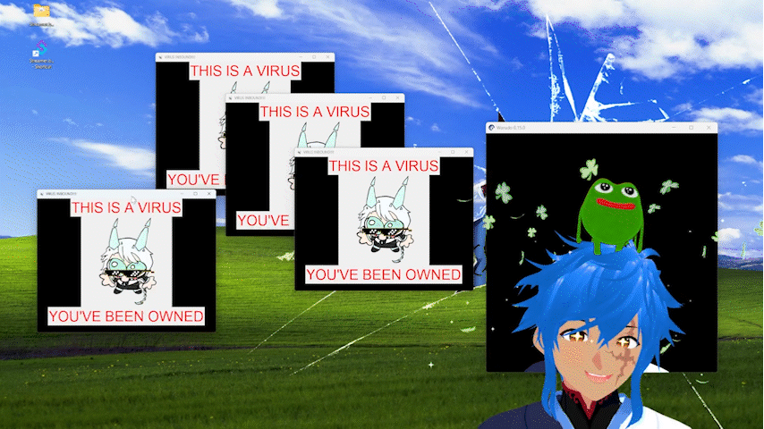

Named after Rayzyro, a member of the Mochi Squad known for his chaotic antics.

## Table of Contents
- [Installation]()
- [Usage]()
- [Building from Source]()
- [License]()


## Installation
1. Download a release from the [Releases Tab](https://github.com/Meeecoh/ray-virus/releases) on the right side.  
2. Double-click the application to run

*Linux and MacOS Distributions have not been tested. The Python packages included should be cross-compatible but your mileage may vary.*

## Usage

Requires : 
- Affiliate Status on Twitch for Channel Point Redeems
- [Streamer.bot](https://streamer.bot/) w/ Twitch connected

### 1. Connect Twitch to Streamerbot
Twitch needs to be connected to Streamerbot to monitor channel point redeems.  
Settings are at `Platforms > Twitch ` and scroll down to `Accounts` and login to your `Broadcaster Account`.

<div align="center">
    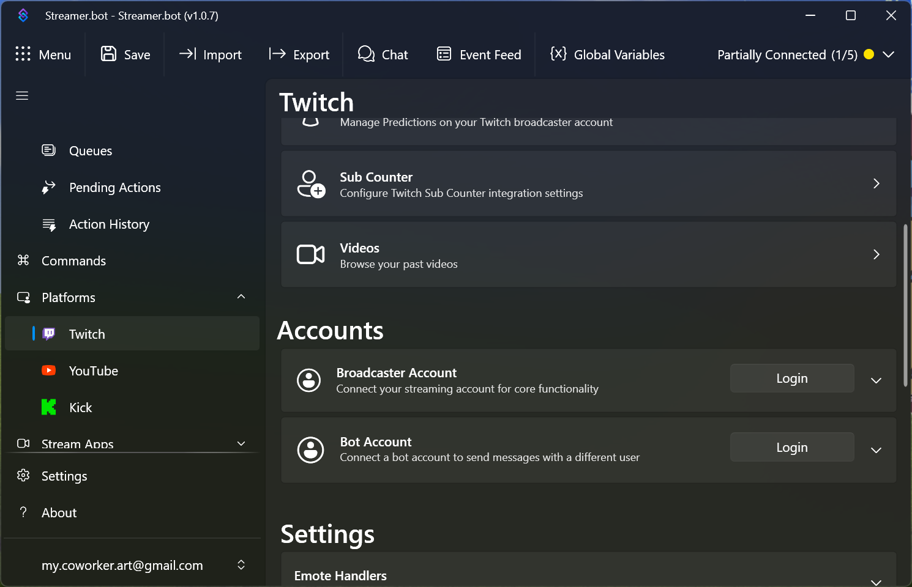
</div>

### 2. Add a Twitch Redeem
Twitch redeems can be set using Streamer.bot

<div align="center">
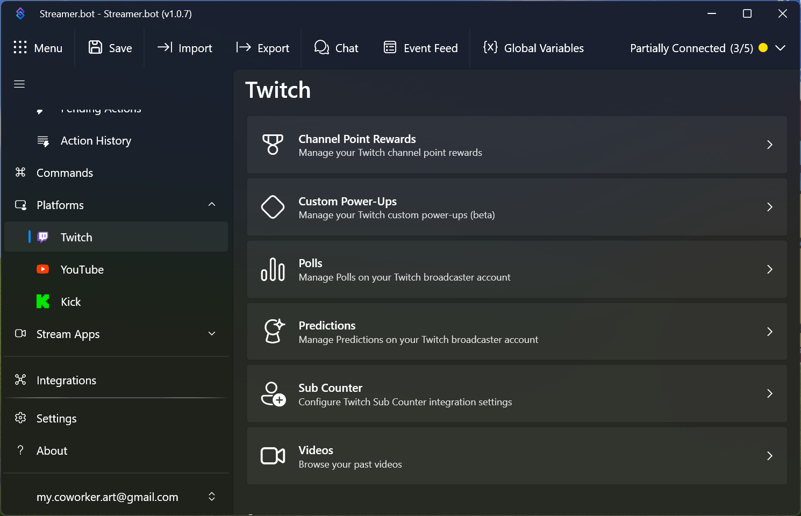


click on `Channel Point Rewards` to manage Redeems


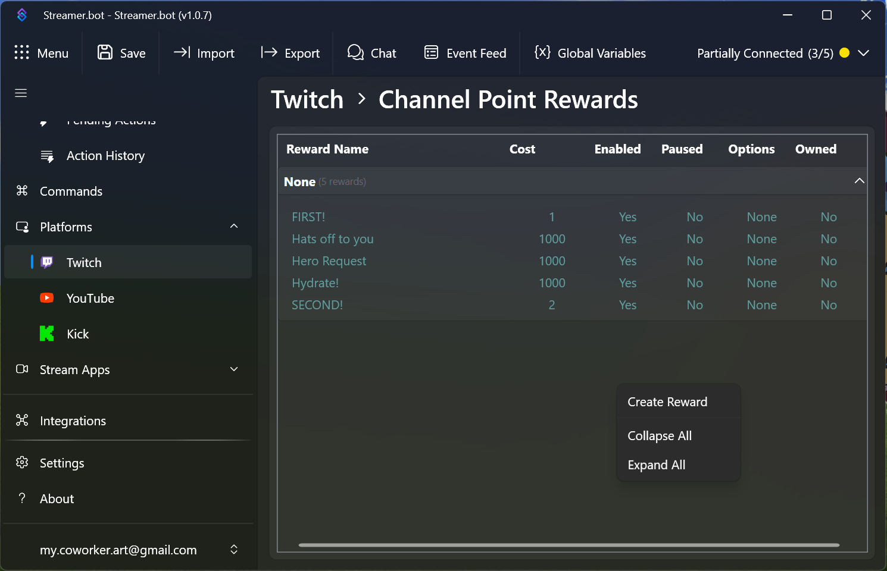


Right click the empty space  
Click `Create Reward`  to create a new channel point redeem

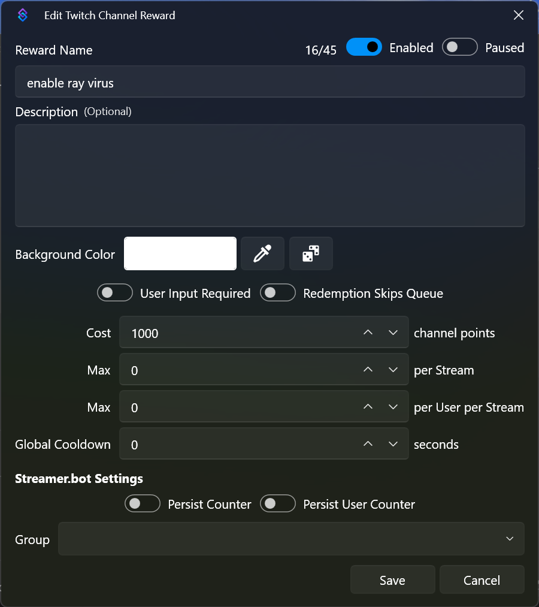

Enter the name, cost, and any other settings you'd like to change
</div>

### 3. Start Streamerbot's Websocket Server
Ray Virus uses streamer.bot as a websocket server to monitor Twitch channel point redeems.   

<div align="center">
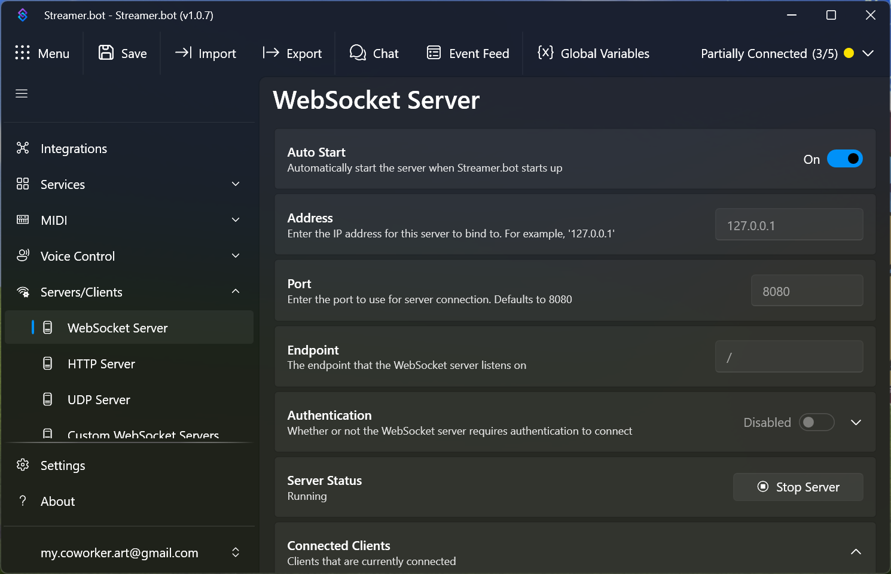

Websocket server settings in Streamerbot are at `Servers/Clients > WebSocket Server`.  
Turn on `Autostart` and start the server by clicking `Start Server`. 
</div>


### 4. Configure the Ray Virus

<div align="center">
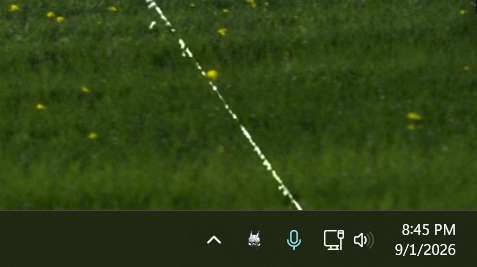
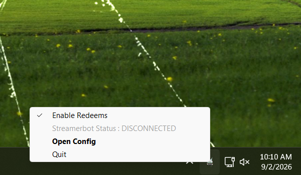

The Ray Virus shows up as a system icon  
Left-clicking opens the config menu,  
Right-clicking opens a context menu to view status and enable redeems

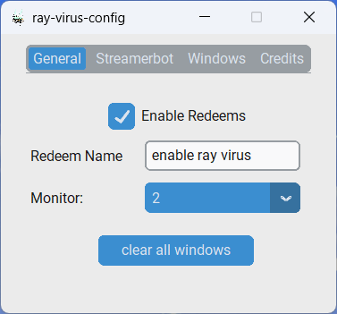  

The General tab of the config menu allows you to enable/disable redeems   
and setup which monitors windows show up in. 

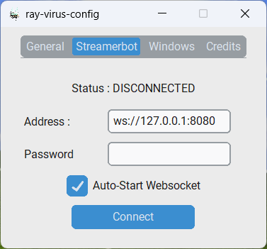  

The Streamer.bot tab shows websocket connection status and allows  
you to configure the address and password of the websocket server. 

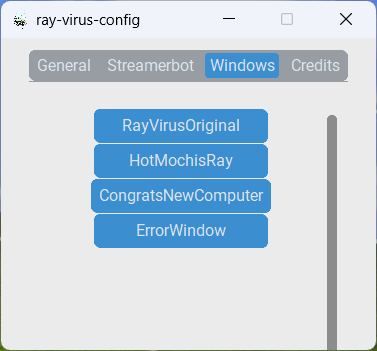

The Windows tab allows you to test out various included windows.

</div>


## Building From Source
-- Tested with python v3.14.6 --
1. Clone the repository
```
git clone https://github.com/Meeecoh/ray-virus.git
cd ray-virus
```
2. Create virtual environment
```
# activate (macOS/Linux)
python -m venv .venv 
source .venv/bin/activate
```
```
# activate (windows)
python -m venv .venv 
.venv/Scripts/activate.bat
```
3. Install Dependencies
```
pip install -r requirements.txt
```
3. Run build script. Builds should be generated in `dist/`
```
# windows
./make_build.ps1
```
```
# (macOS/Linux)
./make_build.sh
```

## License
This repository is licensed under the [MIT LICENSE](LICENSE)

